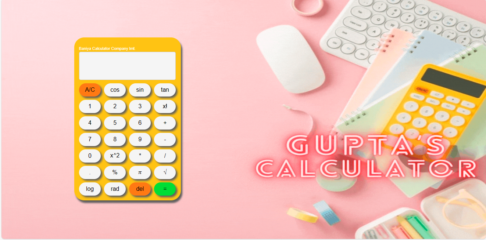

# Calculator Project

This is a basic calculator project created using HTML, CSS, and JavaScript. Please note that some functions may not work properly, and the project is a work in progress. Improvements and enhancements are planned for the future.

## Usage

To use the calculator, simply open the `index.html` file in your web browser. You can perform basic arithmetic operations such as addition, subtraction, multiplication, and division. Some functions may not work as expected, but updates are planned to improve functionality.

## Preview

## Contributing

Contributions to improve the calculator project are welcome! Feel free to fork the repository, make improvements, and submit a pull request.

